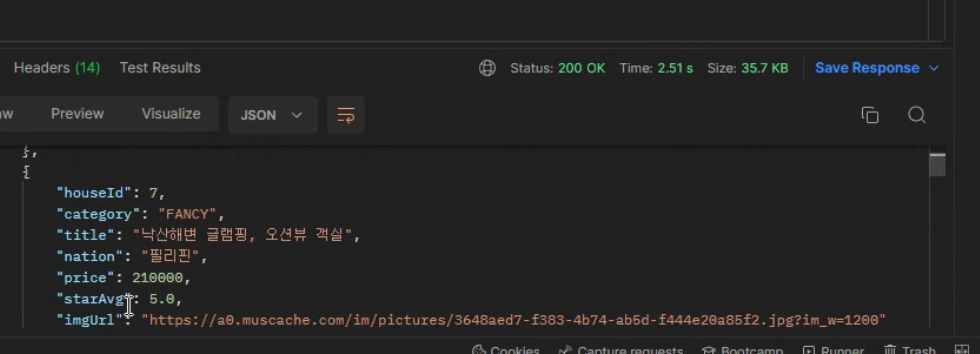
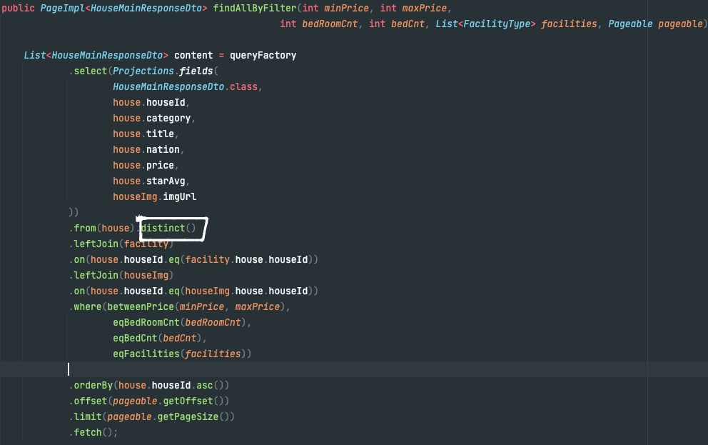
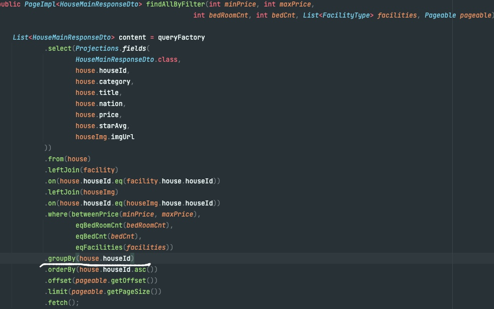

# 프로젝트 소개

<h2>에어비엔비 클론코딩</h2>
<li>개발 인원 : 프론트엔드 3명, 백엔드 3명</li>
<li>개발 기간 : 8/19 ~ 8/25</li>
<li>기술 스택: 

</li>

<li>배포 환경 : 

</li>

<li>협업 도구 : 

</li>

<h2><a href=https://www.notion.so/SA-5-b42691a27f1048768da8880bae9727c2>팀 노션</a></h2>

## 👨‍👧‍👦 Front 구성원

|  Name  |            Github            |        Role        |
|:------:|:----------------------------:|:------------------:|
| 👦 신원혁 | https://github.com/god1hyuk  |      카테고리,숙소       |
| 👦 문경록 |   https://github.com/rokga   |    로그인,회원가입,숙소     |
| 👦 안승현 |  https://github.com/zemiles  |   위시리스트,후기작성,필터    |

# 주요기능 및 소개
### **🗺** ERD 설계

### **🐋** 트러블 슈팅

### ***1.속도 개선 ***

  주석 처리된 builder를 사용하여 메인페이지에 해당하는 게시글을 호출 하였을때 여러번의 for문을 이용하다보니
  Postman을 이용하여 검사를 했을때 17초까지 나오는 문제가 발생 하였다.

  **여러번 호출을 하지 않고 개선 하기 위해 Querydsl 사용하여 해당하는 컬럼만 조회하는걸로 리팩토링을 통해 조회 시간을 대폭 감소시킴.

  

### 2. Pageable 사용 시 호출 중복 문제 
 
    
  .distinct() 를 사용하여 중복 되는 값들을 해결 하려고 했지만 중복된 값들이 호출 되는 문제가 발생 함.
     

  ** .distinct()를 사용하여 중복값이 해결 안되는것을 확인하여 또 다른 중복제거 방법인 .groupBy코드를 사용 하여 확인을 해보니 중복된 값들이  
  나오지 않고 정상적으로 실행 되는것을 확인 하였습니다.

